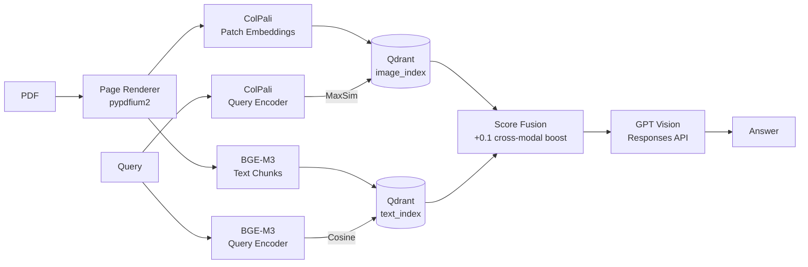

# Multimodal RAG — Ask questions about diagrams and charts, not just text.

> **[Live Demo](https://multimodal-rag-images-and-text-retrieval.vercel.app)**  
> Backend: Railway · Vector DB: Qdrant Cloud · Frontend: Vercel

---

## What makes this different

Most RAG systems embed text only — they're blind to diagrams, charts,
and tables. This project uses **ColPali**, a vision-language model that
embeds entire page images as patch-level vectors, enabling retrieval
from visual content that text chunking would miss entirely.

---

## Architecture



---

## Benchmark: Multimodal vs Text-Only RAG

10 questions answerable only from diagrams/tables in the H100 whitepaper.
Scored manually.

| Pipeline | Correct | Accuracy |
|----------|---------|----------|
| Text-only RAG | 6 / 10 | 60% |
| Multimodal RAG (this project) | 8 / 10 | 80% |

Key wins for multimodal:
- **Texture units** (Q2): text-only gave TPC count; multimodal read 528 from the spec table image
- **Memory data rate** (Q9): text-only gave bandwidth; multimodal read exact 2619 MHz DDR from table

---

## Example Queries (try these on the H100 demo)

- "What is the memory bandwidth of H100 SXM5?"
- "How many texture units does H100 have?"
- "Compare H100 and A100 memory specifications"
- "What does the Transformer Engine do?"
- "What manufacturing process is H100 built on?"
- "What is the peak FP8 Tensor TFLOPS of H100?"

---

## Setup (5 steps)

```bash
# 1. Clone and install
git clone https://github.com/Nagarjunan0904/Multimodal_RAG_Images_and_Text_Retrieval
cd Multimodal_RAG_Images_and_Text_Retrieval
pip install -r requirements.txt

# 2. Set environment variables
cp .env.example .env
# Edit .env: OPENAI_API_KEY, QDRANT_URL, HF_HOME

# 3. Start Qdrant
docker compose up -d

# 4. Ingest demo PDF
python -m backend.main demo.pdf

# 5. Start backend + frontend
uvicorn backend.main:app --reload
cd frontend && npm run dev
```

---

## Tech Stack

| Component | Choice | Why |
|-----------|--------|-----|
| Image retrieval | ColPali (vidore/colpali-v1.2) | OCR-free patch-level embeddings — sees diagrams |
| Vector DB | Qdrant | Native multivector/MaxSim support for ColPali |
| Text retrieval | BGE-M3 | State-of-the-art dense retrieval, multilingual |
| Generation | GPT-5.4-mini (Responses API) | Vision-capable, streaming, reproducible alias |
| Backend | FastAPI + uvicorn | Async, SSE streaming, production-ready |
| Frontend | Vite + React + Tailwind v4 | Fast build, no config overhead |
| PDF rendering | pypdfium2 | Accurate page-to-image conversion |

---

## Project Structure

```text
backend/
  main.py              FastAPI app, ingestion/query/SSE/static routes
  retriever.py         ColPali image retrieval, BGE-M3 text retrieval, fusion
  generator.py         GPT Responses API answer generation
  qdrant_client.py     Qdrant local/cloud client and collection setup
  models/              Pydantic settings and schemas
frontend/
  src/
    App.jsx            Two-stage upload/query experience
    api/client.js      HTTP and EventSource API client
    components/        Upload, document list, query, result, answer panels
eval/
  logger.py            SQLite eval logger
scripts/
  seed_demo.py         Upload demo.pdf to a deployed backend
  eval_pipeline.py     Offline text-only vs multimodal benchmark
```

---

## Evaluation

Run the offline benchmark after ingesting the demo document:

```bash
python scripts/eval_pipeline.py
```

Results are written to `eval/benchmark_results.json`. Answers are scored manually before publishing metrics.

---

## Deployment

Production deployment uses:
- Frontend: Vercel
- Backend: Railway or Render
- Vector DB: Qdrant Cloud

See [DEPLOY.md](DEPLOY.md) for Docker, Qdrant Cloud, Railway/Render, and Vercel instructions.
